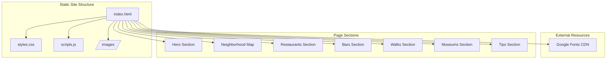

# Design Document: Madrid City Guide

## Overview

The Madrid City Guide is a static single-page web application designed to share personal recommendations for visitors to Madrid. The site follows a content-first approach with an elegant, warm aesthetic inspired by travel guides. Built entirely with HTML, CSS, and minimal JavaScript, it will be hosted on GitHub Pages.

The design prioritizes:
- Visual appeal with a cohesive warm color palette and elegant typography
- Easy navigation through a long-scrolling single page with distinct sections
- Mobile-first responsive design for on-the-go reference
- Performance through optimized assets and lazy loading
- Accessibility compliance for all users

## Architecture



### File Structure

```
madrid-city-guide/
├── index.html          # Main HTML document
├── css/
│   └── styles.css      # All styles including responsive breakpoints
├── js/
│   └── scripts.js      # Lazy loading and optional interactions
├── images/
│   ├── hero/           # Hero section images
│   ├── map/            # Neighborhood map assets
│   ├── restaurants/    # Restaurant photos
│   ├── bars/           # Bar photos
│   ├── walks/          # Walk/route photos
│   └── museums/        # Museum photos
└── README.md           # Documentation
```

## Components and Interfaces

### 1. Hero Section Component

The hero section serves as the landing area with a welcoming introduction.

```html
<section class="hero" id="hero">
  <div class="hero__content">
    <h1 class="hero__title">Madrid</h1>
    <p class="hero__subtitle">A Local's Guide</p>
    <p class="hero__intro">Personal recommendations from 4 years of living in this beautiful city</p>
  </div>
  <div class="hero__image">
    
  </div>
</section>
```

### 2. Neighborhood Map Component

An illustrated SVG-based map with colored overlays for each barrio.

```html
<section class="neighborhood-map" id="neighborhoods">
  <h2 class="section__title">Neighborhoods</h2>
  <div class="map__container">
    <svg class="map__svg" viewBox="0 0 800 600" role="img" aria-label="Map of Madrid neighborhoods">
      <!-- Base map layer -->
      <g class="map__base">...</g>
      <!-- Neighborhood overlays -->
      <g class="map__zones">
        <path class="zone zone--sol" d="..." aria-label="Sol/Centro"/>
        <path class="zone zone--latina" d="..." aria-label="La Latina"/>
        <path class="zone zone--malasana" d="..." aria-label="Malasaña"/>
        <path class="zone zone--chueca" d="..." aria-label="Chueca"/>
        <path class="zone zone--lavapies" d="..." aria-label="Lavapiés"/>
        <path class="zone zone--letras" d="..." aria-label="Barrio de las Letras"/>
        <path class="zone zone--retiro" d="..." aria-label="Retiro"/>
        <path class="zone zone--austrias" d="..." aria-label="Austrias"/>
      </g>
    </svg>
    <div class="map__legend">
      <div class="legend__item"><span class="legend__color legend__color--sol"></span>Sol/Centro</div>
      <div class="legend__item"><span class="legend__color legend__color--latina"></span>La Latina</div>
      <!-- ... other legend items -->
    </div>
  </div>
</section>
```

### 3. Content Section Component

A reusable section structure for each category.

```html
<section class="content-section" id="restaurants">
  <h2 class="section__title">Restaurants</h2>
  <div class="photo-grid">
    
    
    
  </div>
  <div class="cards-grid">
    <!-- Content cards go here -->
  </div>
</section>
```

### 4. Content Card Component

Individual recommendation cards with consistent structure.

```html
<article class="content-card">
  <h3 class="card__title">Restaurant Name</h3>
  <div class="card__meta">
    <span class="card__location">
      <svg class="icon">...</svg>
      La Latina
    </span>
    <span class="card__travel-time">
      <svg class="icon">...</svg>
      15 min from Sol
    </span>
  </div>
  <p class="card__known-for">
    <strong>Known for:</strong> Traditional cocido madrileño, cozy atmosphere, local crowd
  </p>
</article>
```

### 5. Photo Grid Component

Responsive image grid for section headers.

```html
<div class="photo-grid photo-grid--3col">
  <figure class="photo-grid__item">
    
  </figure>
  <figure class="photo-grid__item photo-grid__item--featured">
    
  </figure>
  <figure class="photo-grid__item">
    
  </figure>
</div>
```

## Data Models

### Color Palette

```css
:root {
  /* Primary colors */
  --color-background: #ede9d7;      /* Cream/beige */
  --color-text: #4e2a1e;            /* Dark brown */
  --color-accent-blue: #98b7d2;     /* Muted blue */
  --color-accent-green: #32412d;    /* Sage green */
  
  /* Derived colors */
  --color-card-bg: #f5f2e8;         /* Lighter cream for cards */
  --color-border: #d4cfc0;          /* Subtle border */
  --color-text-muted: #7a5c4f;      /* Muted brown for secondary text */
}
```

### Typography Scale

```css
:root {
  /* Font families */
  --font-heading: 'Ovo', serif;
  --font-body: 'Fraunces', serif;
  
  /* Font sizes */
  --text-xs: 0.75rem;    /* 12px */
  --text-sm: 0.875rem;   /* 14px */
  --text-base: 1rem;     /* 16px */
  --text-lg: 1.125rem;   /* 18px */
  --text-xl: 1.25rem;    /* 20px */
  --text-2xl: 1.5rem;    /* 24px */
  --text-3xl: 1.875rem;  /* 30px */
  --text-4xl: 2.25rem;   /* 36px */
  --text-5xl: 3rem;      /* 48px */
}
```

### Spacing System

```css
:root {
  --space-1: 0.25rem;   /* 4px */
  --space-2: 0.5rem;    /* 8px */
  --space-3: 0.75rem;   /* 12px */
  --space-4: 1rem;      /* 16px */
  --space-6: 1.5rem;    /* 24px */
  --space-8: 2rem;      /* 32px */
  --space-12: 3rem;     /* 48px */
  --space-16: 4rem;     /* 64px */
  --space-24: 6rem;     /* 96px */
}
```

### Breakpoints

```css
/* Mobile first approach */
--breakpoint-sm: 640px;   /* Small tablets */
--breakpoint-md: 768px;   /* Tablets */
--breakpoint-lg: 1024px;  /* Laptops */
--breakpoint-xl: 1280px;  /* Desktops */
```

### Content Card Data Structure

Each recommendation follows this conceptual structure:

```
ContentCard {
  title: string           // Name of the place
  neighborhood: string    // Which barrio it's in
  travelTime: string      // Time from central location
  knownFor: string        // Description of what makes it special
  category: enum          // restaurants | bars | walks | museums | tips
}
```

### Neighborhood Zone Data

```
NeighborhoodZone {
  id: string              // Unique identifier (e.g., "sol", "latina")
  name: string            // Display name (e.g., "Sol/Centro", "La Latina")
  color: string           // Hex color for the zone overlay
  description: string     // Brief description of the area's character
}
```

Neighborhood color assignments:
- Sol/Centro: #e8c170 (warm gold)
- La Latina: #c17f59 (terracotta)
- Malasaña: #98b7d2 (muted blue)
- Chueca: #d4a5c9 (dusty pink)
- Lavapiés: #a8c090 (light sage)
- Barrio de las Letras: #c9b896 (warm tan)
- Retiro: #32412d (sage green)
- Austrias: #b8a07e (golden brown)


## Correctness Properties

*A property is a characteristic or behavior that should hold true across all valid executions of a system—essentially, a formal statement about what the system should do. Properties serve as the bridge between human-readable specifications and machine-verifiable correctness guarantees.*

### Property 1: Heading Typography Consistency

*For any* heading element (h1, h2, h3, h4, h5, h6) in the document, the computed font-family SHALL include 'Ovo'.

**Validates: Requirements 1.3, 3.4, 6.1**

### Property 2: Body Typography Consistency

*For any* paragraph or body text element in the document, the computed font-family SHALL include 'Fraunces'.

**Validates: Requirements 4.2, 6.2**

### Property 3: Neighborhood Zone Color Uniqueness

*For any* two distinct neighborhood zones in the map, their fill colors SHALL be different from each other.

**Validates: Requirements 2.2**

### Property 4: Legend-Zone Correspondence

*For any* neighborhood zone displayed in the map, there SHALL exist a corresponding legend entry with matching name and color.

**Validates: Requirements 2.3**

### Property 5: Content Card Structure Completeness

*For any* content card element, it SHALL contain: a title element, a location/neighborhood element, a travel time element, and a "Known for" description element.

**Validates: Requirements 4.1**

### Property 6: Section Photo Grid Presence

*For any* content section (Restaurants, Bars, Walks, Museums, Tips), there SHALL be a photo grid element containing at least one image.

**Validates: Requirements 3.3**

### Property 7: Photo Grid Multi-Image Requirement

*For any* photo grid element, it SHALL contain multiple (2 or more) image elements.

**Validates: Requirements 5.1**

### Property 8: Image Aspect Ratio Preservation

*For any* image within a photo grid, the CSS object-fit property SHALL be set to 'cover' or 'contain' to prevent distortion.

**Validates: Requirements 5.4**

### Property 9: No Horizontal Overflow

*For any* viewport width from 320px to 1920px, the document body's scrollWidth SHALL NOT exceed the viewport width.

**Validates: Requirements 7.2**

### Property 10: Responsive Grid Column Reduction

*For any* content card grid, the number of columns at viewport width < 768px SHALL be less than or equal to the number of columns at viewport width >= 1024px.

**Validates: Requirements 4.3, 7.1, 7.4**

### Property 11: Semantic Heading Hierarchy

*For any* heading element in the document, its level SHALL NOT skip more than one level from its nearest ancestor heading (e.g., h2 can follow h1, but h4 should not directly follow h1).

**Validates: Requirements 9.1**

### Property 12: Image Alt Text Presence

*For any* img element in the document, the alt attribute SHALL exist and contain a non-empty string.

**Validates: Requirements 9.2**

### Property 13: Color Contrast Compliance

*For any* text element and its background, the contrast ratio SHALL meet WCAG AA standards (4.5:1 for normal text, 3:1 for large text).

**Validates: Requirements 9.3**

### Property 14: Lazy Loading for Below-Fold Images

*For any* img element that is not within the initial viewport (hero section), the loading attribute SHALL be set to "lazy".

**Validates: Requirements 10.3**

## Error Handling

### Image Loading Failures

- All images should have appropriate alt text that provides meaningful context if the image fails to load
- Consider using CSS background colors as fallbacks for decorative images
- Photo grids should gracefully handle missing images without breaking layout

### Font Loading Failures

- Define fallback font stacks: `'Ovo', Georgia, serif` and `'Fraunces', Georgia, serif`
- Use `font-display: swap` to prevent invisible text during font loading
- Ensure the page remains readable with system fonts

### SVG Map Rendering Issues

- Provide a static image fallback for the neighborhood map
- Include descriptive text alternative for screen readers
- Ensure map is still informative without JavaScript

### Responsive Layout Edge Cases

- Test at extreme viewport widths (320px minimum)
- Ensure text doesn't overflow containers
- Handle very long place names gracefully with text truncation or wrapping

## Testing Strategy

### Unit Testing Approach

Unit tests will verify specific examples and edge cases:

1. **DOM Structure Tests**: Verify required elements exist with correct attributes
2. **CSS Property Tests**: Check computed styles match design specifications
3. **Accessibility Tests**: Validate alt text, heading hierarchy, ARIA labels

### Property-Based Testing Approach

Property tests will verify universal properties across all elements:

1. **Typography Properties**: All headings use Ovo, all body text uses Fraunces
2. **Structural Properties**: All cards have required elements, all sections have photo grids
3. **Responsive Properties**: No horizontal overflow at any viewport width
4. **Accessibility Properties**: All images have alt text, proper heading hierarchy

### Testing Tools

- **Jest + jsdom**: For DOM structure and attribute testing
- **fast-check**: For property-based testing with generated inputs
- **axe-core**: For automated accessibility testing
- **Playwright**: For visual regression and responsive testing

### Test Configuration

- Property tests: Minimum 100 iterations per property
- Viewport testing: Test at 320px, 640px, 768px, 1024px, 1280px, 1920px
- Each property test tagged with: **Feature: madrid-city-guide, Property {N}: {property_text}**

### Test Categories

1. **Structure Tests**
   - Verify all required sections exist
   - Verify content card structure
   - Verify photo grid structure

2. **Style Tests**
   - Verify color palette usage
   - Verify typography application
   - Verify responsive breakpoints

3. **Accessibility Tests**
   - Verify alt text on all images
   - Verify heading hierarchy
   - Verify color contrast ratios
   - Verify keyboard navigation

4. **Performance Tests**
   - Verify lazy loading attributes
   - Verify font loading strategy
   - Verify no render-blocking resources
